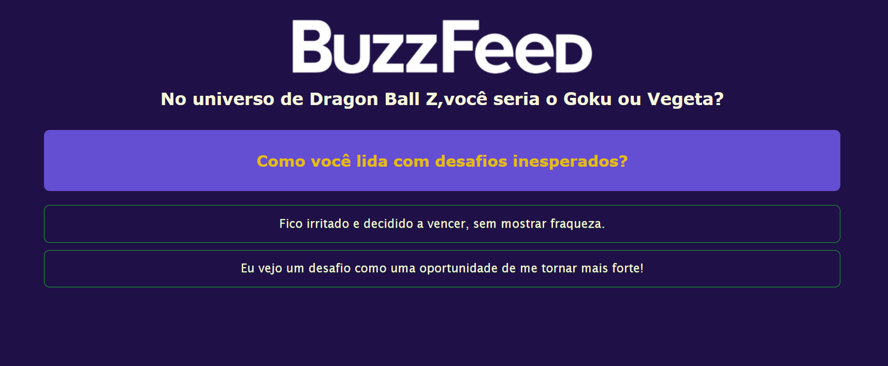

# Angular Clone Buzzfeed

<h2>Descrição:</h2>

Projeto baseado no BuzzFeed,nesse quiz com 6 perguntas, o usuário deve escolher a que mais se indentifica.Ao final sera apresentado na tela qual personagem do Dragon Ball Z (Goku ou Vegeta),ele seria. 

<h2>Tecnologias:</h2>

<h3>Deploy Vercel:</h3>
🔗https://angular-buzzfeed-umber.vercel.app/
